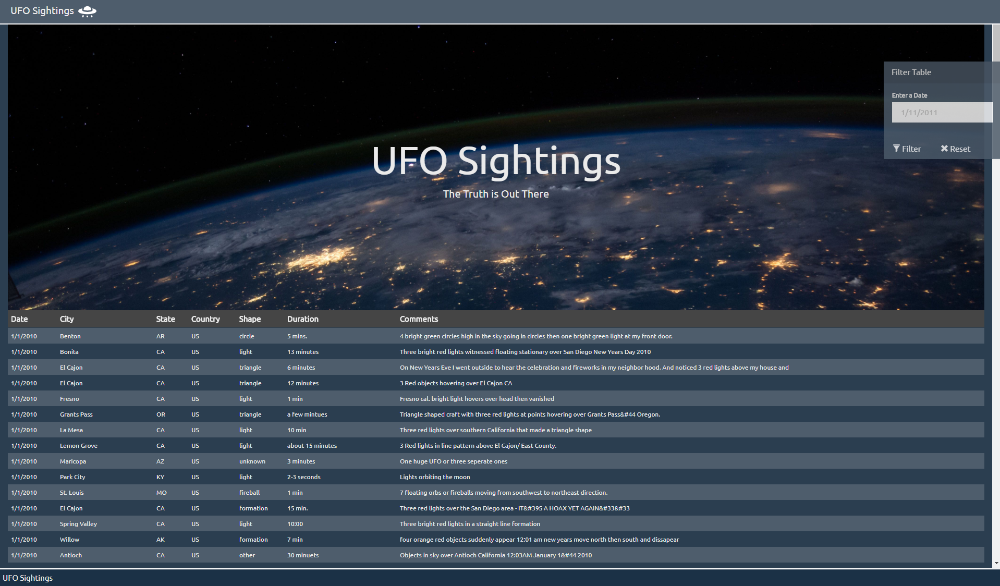
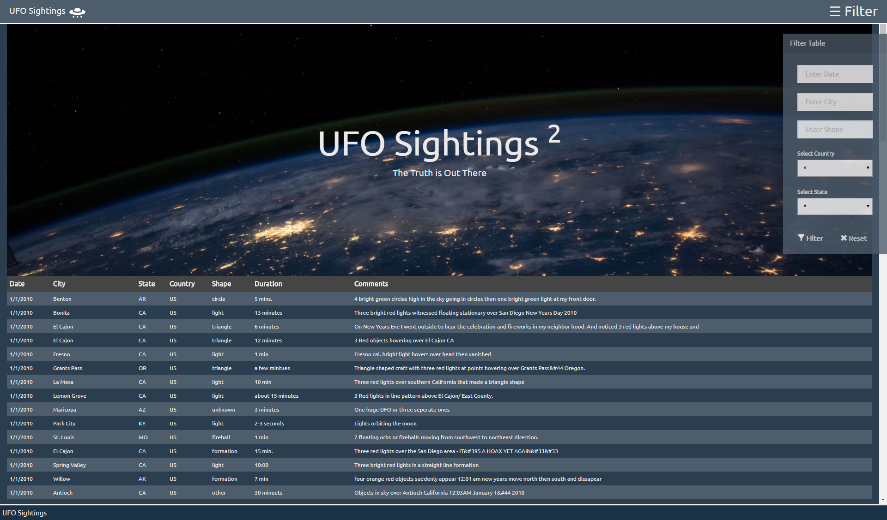

# javascript-challenge

## Summary

* UFO-level-1 solution provided
* UFO-level-2 solution provided
  
### Page Layout has been improved:
1) Page shows the original picture (I like it)
2) Fix navigation bar and footer
3) Table uses vertical scrolling and sticky header
4) Table covers the whole screen width for better radebility
5) Filter menu is located on the left site to provide better readebilityadebility
6) Input text capitalization is updated during table buildup

### Filter functionality:
1) Filter side menu:
	- is opened by click on the Filter at the right top corned of the page
    - menu is closed by second click on Filter
	- it is available only in UFO-level-2 
	- :warning: it closed by default
2) Is activated with either keyup, or by click on Filter button (this is redundant)
3) Uses regex for string values (datetime, city, shape):
	- searches for a subtring in the corresponding field
	- search is case sensitive
	- user can enter regular expression
	- :information_source: treating datatime as string provides more option for searching
4) Country and State dropdown are cascaded, change in Country automatically reloads States
5) Values are combined with AND
6) Clearing of the filter removes all values and shows all rows
7) Table is not rebuilt after filter cleanup, display=none is used istead of removing values from DOM

### The code
* Is located in ~/static/app.js files
* Uses encapsulation, see <b>[IIFE](https://developer.mozilla.org/en-US/docs/Glossary/IIFE)</b>

## Results

#### UFO-level-1 Page

#### UFO-level-2 Page

* Notice filter menu on top right side of navbar; menu is hidden by default

